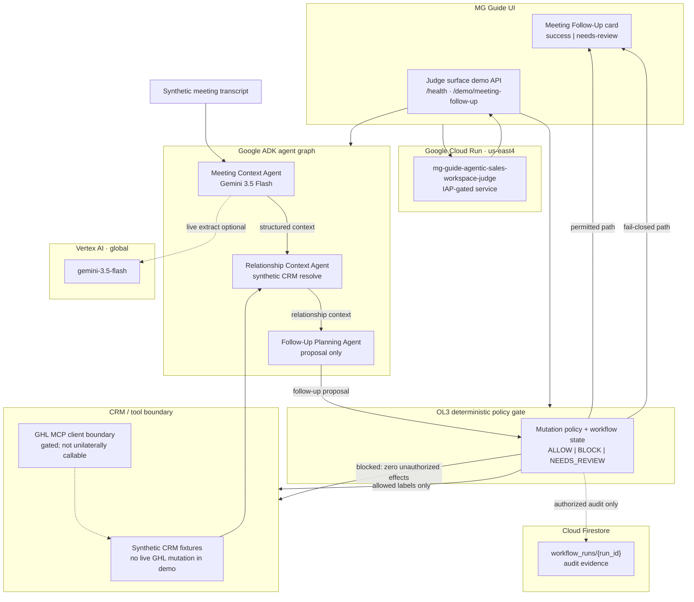

# meeting_follow_up_v1 — Competition Architecture

```text
ARTIFACT=docs/architecture/meeting-follow-up-v1-competition-architecture.md
WORKFLOW=meeting_follow_up_v1
COMPETITION=Google All Things Agentic Hackathon
TRACK=Fortified Enterprise Fleet
```

## System diagram



## Authority sequence

```text
1. Transcript (synthetic) enters Meeting Context Agent
2. Gemini proposes structured extraction (never mutates CRM)
3. Relationship Context Agent resolves contact/opportunity offline
4. Follow-Up Planning Agent proposes next step / note / stage intent
5. OL3 deterministic policy gate is sole write authority
6. On ALLOW: synthetic effect labels + audit projection (Firestore when authorized)
7. On BLOCK: needs-review state; EXTERNAL_EFFECTS remain 0 for unauthorized paths
8. MG Guide card renders salesperson next-step state
```

## Layer map

| Layer | Technology | Role |
| --- | --- | --- |
| Reasoning | Gemini 3.5 Flash (Vertex AI) | Extract meeting context; propose only |
| Agent runtime | Google ADK 1.18.0 | Sequential multi-agent orchestration |
| Policy | OL3 deterministic gate | Authorize or block CRM-bound effects |
| Hosting | Cloud Run (`us-east4`) | Judge / demo surface |
| Audit | Firestore (`devpost-google-contest`) | `workflow_runs` persistence proof |
| Boundary | Synthetic CRM + GHL MCP seam | No unilateral agent tool writes |
| UX | MG Guide Meeting Follow-Up card | Success + needs-review states |

## Fail-closed guarantee

Agents **cannot** bypass OL3. Ambiguous identity (`AMBIGUOUS_CONTACT`) yields:

- `workflow_status=blocked`
- `note_write=not_attempted` / `stage_write=not_attempted`
- `external_effects=0`
- `cloud_mutation=NONE` on the demo path

## Competition proof anchors

- Gemini live: Meeting Context provider with Vertex ADC
- ADK: Unit3 harness `SUCCESS` + `AMBIGUOUS_CONTACT`
- Cloud Run: service Ready revision on `mg-devpost`
- Firestore: Stage B smoke create/read/verify/delete
- UI: judge demo stages + NW-006 card projection
