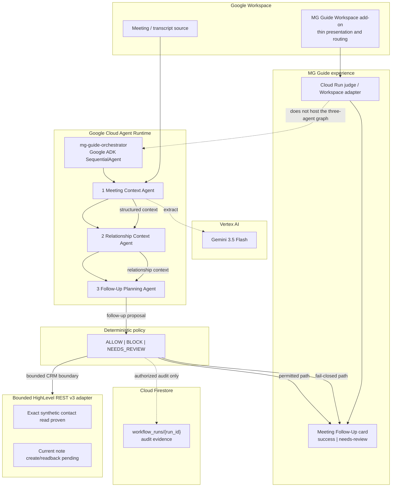

# meeting_follow_up_v1 — Competition Architecture

```text
ARTIFACT=docs/architecture/meeting-follow-up-v1-competition-architecture.md
WORKFLOW=meeting_follow_up_v1
COMPETITION=Google All Things Agentic Hackathon
TRACK=Fortified Enterprise Fleet
```

## System diagram



There is **one** hosted orchestrator deployment. The three agents are internal
sequential agents of `mg-guide-orchestrator`. This is not three separate Agent
Runtime deployments.

Cloud Run is the competition judge / Workspace adapter surface. Google Cloud
Agent Runtime hosts the three-agent graph.

## Authority sequence

```text
1. Transcript enters Meeting Context Agent
2. Gemini proposes structured extraction (never mutates CRM)
3. Relationship Context Agent resolves relationship context
4. Follow-Up Planning Agent proposes next-step intent
5. Deterministic policy is sole write authority
6. On ALLOW: follow-up experience + audit projection (Firestore when authorized)
7. On BLOCK: needs-review state; unauthorized EXTERNAL_EFFECTS remain 0
8. MG Guide card renders salesperson next-step state
```

```text
Agents understand and propose.
Policy decides.
External effects remain separately governed.
```

## Layer map

| Layer | Technology | Role |
| --- | --- | --- |
| Hosted runtime | Google Cloud Agent Runtime · `mg-guide-orchestrator` | One SequentialAgent deployment containing the three-agent sequence |
| Reasoning | Gemini 3.5 Flash (Vertex AI) | Extract meeting context; propose only |
| Agent framework | Google ADK | Sequential multi-agent orchestration |
| Policy | Deterministic gate | Authorize or block CRM-bound effects |
| Judge / adapter hosting | Cloud Run | Competition judge / Workspace adapter surface |
| Audit | Firestore | `workflow_runs` persistence proof |
| CRM boundary | HighLevel REST v3 bounded adapter | Current transport; exact synthetic contact read proven |
| UX | MG Guide Meeting Follow-Up card + Workspace add-on | Success + needs-review; add-on is presentation/routing only |

## Specialized agents

| Agent | Runtime name | Role |
| --- | --- | --- |
| Meeting Context Agent | `meeting_context_agent` | Understands what happened |
| Relationship Context Agent | `relationship_context_agent` | Connects the meeting to relationship context |
| Follow-Up Planning Agent | `follow_up_planning_agent` | Recommends next steps |

## CRM transport

Current primary boundary: **HighLevel REST v3 bounded adapter**.

```text
LIVE_REST_V3_EXACT_CONTACT_READ=PASS
CURRENT_REST_V3_NOTE_CREATE=PENDING
CURRENT_REST_V3_NOTE_READBACK=PENDING
INGESTION_TO_LIVE_GHL_SINGLE_RUN_PROVEN=NO
```

Do not claim current REST note-write completion.

Historical HighLevel MCP evidence may remain as historical / supporting only.
It is not the current primary GHL transport.

Historical Grant 008 live synthetic note+stage proof is supporting evidence
only, not the current transport centerpiece.

## Fail-closed guarantee

Agents **cannot** bypass deterministic policy. Ambiguous identity
(`AMBIGUOUS_CONTACT`) yields:

- `workflow_status=blocked`
- `note_write=not_attempted` / `stage_write=not_attempted`
- `external_effects=0`
- `cloud_mutation=NONE` on the demo path

## Synthetic-data boundary

Competition demonstration uses synthetic / test data. Real-customer records are
out of scope. The Workspace add-on does not own policy, CRM mutation, agent
reasoning, or workflow truth.

## Competition proof anchors

- Gemini live: Meeting Context provider with Vertex AI
- ADK hosted sequence: Agent Runtime `mg-guide-orchestrator`
- Success + fail-closed: competition acceptance packet
- Cloud Run: judge / Workspace adapter surface
- Firestore: Stage B smoke create/read/verify/delete
- REST v3: exact synthetic contact live read
- UI: judge demo stages + Workspace add-on presentation

See [docs/judges/PROOF_INDEX.md](../judges/PROOF_INDEX.md).
