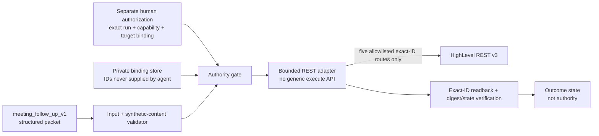

# NW-008 AT-1 — HighLevel REST Adapter Architecture 001

```text
UNIT=NW008_AT1_GHL_REST_ADAPTER_ARCHITECTURE_001
WORKFLOW=meeting_follow_up_v1
MODE=ARCHITECTURE_ONLY
OWNER=VS Code orchestrator
PLAN_BASE_REF=origin/main
PLAN_BASE_SHA=667c5c063fe03942256212d66f0aa5e7b7781355
PLAN_BRANCH=planning/nw008-at1-ghl-rest-adapter-architecture-001
PR92_MERGE_SHA=667c5c063fe03942256212d66f0aa5e7b7781355
ORIGIN_MAIN_CONTAINS_PR92=YES
```

## 1. Purpose and authority boundary

This artifact defines, but does not implement or execute, a bounded HighLevel
REST v3 adapter. A future separately authorized implementation may consume the
structured output of `meeting_follow_up_v1`, create one verified note on the
privately allowlisted synthetic contact, and optionally perform one separately
authorized opportunity-stage transition.

The target is an active canonical business CRM. Its safety boundary is a
private, preverified synthetic-record allowlist and exact-ID-only access, not
environment isolation.

```text
CRM_ENVIRONMENT_CLASS=ACTIVE_CANONICAL_BUSINESS_CRM
SYNTHETIC_ONLY=YES
PRIVATE_ALLOWLIST_REQUIRED=YES
EXACT_ID_TARGETING_REQUIRED=YES
BROAD_SEARCH_AUTHORIZED=NO
LIST_PAGINATION_EXPANSION_AUTHORIZED=NO
ALTERNATE_TARGET_SEARCH_AUTHORIZED=NO
NON_ALLOWLISTED_RECORD_ACCESS_AUTHORIZED=NO
REAL_CUSTOMER_RECORD_READ_AUTHORIZED=NO
REAL_CUSTOMER_RECORD_MUTATION_AUTHORIZED=NO

ARCHITECTURE_DEFINED=YES
NOTE_PATH_ARCHITECTURE_READY=YES
STAGE_PATH_ARCHITECTURE_READY=NO
STAGE_PATH_BLOCKER=MINIMUM_VALID_UPDATE_OPPORTUNITY_BODY_UNRESOLVED
IMPLEMENTATION_AUTHORIZED=NO
LIVE_READ_AUTHORIZED=NO
LIVE_MUTATION_AUTHORIZED=NO
LIVE_EXECUTION_AUTHORIZED=NO
LIVE_CRM_MUTATION_AUTHORIZED=NO
REST_ADAPTER_EXECUTION_AUTHORIZED=NO
SEPARATE_HUMAN_MUTATION_AUTHORIZATION_REQUIRED=YES
EXTERNAL_EFFECTS=0
```

This unit made no HighLevel request, configured no credential, changed no
secret or IAM binding, deployed nothing, modified no Apps Script, and did not
authorize itself.

Path readiness is intentionally split. Note-path architecture readiness does
not authorize implementation or live execution. Stage-path uncertainty must not
block a future note-only implementation review once separately authorized.

## 2. Trust boundaries and components



The workflow and agents may provide only the domain arguments shown in §4.
They cannot provide a URL, HTTP method, contact ID, opportunity ID, pipeline
ID, stage ID outside an authorized symbolic transition, headers, query
parameters, or arbitrary provider body.

Private bindings are loaded by adapter infrastructure only after a future
implementation and live-read authorization. Each slice loads only its required
symbols; those values are deliberately absent from this public artifact.

Private bindings are slice-scoped:

```text
NOTE_PATH required:
location_id
contact_id

STAGE_PATH required:
opportunity_id
pipeline_id
initial_stage_id
final_stage_id
```

Stage parent binding may reference the note-path location/contact binding where
required, but stage configuration is not required to initialize `NOTE_PATH`.

## 3. Provider operation allowlist

The transport must reject every request not matching all columns of one row.
No redirect may be followed. Query strings are forbidden.

| Domain use | Method | Exact path template | Scope | Version | Mutation |
| --- | --- | --- | --- | --- | --- |
| Bound contact preflight | `GET` | `/contacts/{contactId}` | `contacts.readonly` | `v3` | No |
| Create note | `POST` | `/contacts/{contactId}/notes` | `contacts.write` | `v3` | Yes |
| Verify note | `GET` | `/contacts/{contactId}/notes/{noteId}` | `contacts.readonly` | `v3` | No |
| Bound opportunity preflight/readback | `GET` | `/opportunities/{opportunityId}` | `opportunities.readonly` | `v3` | No |
| Update authorized stage | `PUT` | `/opportunities/{opportunityId}` | `opportunities.write` | `v3` | Yes |

`contactId` and `opportunityId` must be injected from the private allowlist.
`noteId` must come only from the successful response to the one note POST in
the same run. It must pass the provider-ID shape constraint resolved during
implementation review before it is placed in the readback path.

The request builder must enforce:

- one configured HTTPS provider origin, with no caller override;
- the five method/path pairs above and no others;
- no search, list, pagination, batch, generic execute, or arbitrary URL API;
- `Authorization` supplied only by the credential provider, never by workflow
  or agent code;
- `Version: v3`;
- JSON request bodies only for the two allowlisted mutations;
- no query parameters;
- no caller-supplied provider fields;
- rejection before network I/O if the fully rendered route or body is not
  allowlisted.

The adapter must not expose an HTTP client, `execute`, `request`, `search`,
`list`, or pass-through operation through its domain interface.

## 4. Domain adapter API

```text
get_bound_contact()
get_bound_opportunity()

create_meeting_note(note_contract)
verify_meeting_note(note_id, expected_note_content_digest)

advance_authorized_stage(expected_from, authorized_to)
verify_authorized_stage(authorized_to)
```

### `get_bound_contact()`

Takes no ID. It reads the private contact ID internally, performs the exact
contact GET once, and accepts the response only under the resolved contact
response contract in §13.2. Consumed fields are limited to `id` and
`locationId`. The returned contact ID must equal the private contact binding,
and the returned location ID must equal the private location binding. Missing
required identity fields or any schema variation fails closed. The full contact
response must not be logged or persisted.

### `get_bound_opportunity()`

Takes no ID. It reads the private opportunity ID internally and performs the
exact opportunity GET. When the stage path is later architecture-ready and
enabled, it accepts only the private opportunity ID, private pipeline ID, and
the bound contact and location IDs where present in the resolved provider
schema. The fresh read used for a stage transition must also show the
authorized initial stage. Consumed fields are limited to required binding and
state fields only; the full opportunity response must not be logged or
persisted. This method remains part of `IMPLEMENTATION_SLICE_2` and is blocked
by the unresolved minimum stage-update body.

### `create_meeting_note(note_contract)`

Accepts the closed note contract in §5, not provider JSON. The adapter
validates and serializes it, computes digests, internally injects the private
contact ID, and constructs only the intentionally narrowed provider body in
§13.3. The method may consume the one-note mutation budget only after all
preflight and capability-authorization checks pass. Requires
`AUTH_CAPABILITY_NOTE_CREATE`.

The resolved create-note response contract is:

```text
CREATE_NOTE_RESPONSE_ENVELOPE=note
CREATE_NOTE_ID_SELECTOR=note.id
CREATE_NOTE_BODY_SELECTOR=note.body
CREATE_NOTE_CONTACT_SELECTOR=note.contactId
```

The returned `note.contactId` must equal the private note-path contact binding.
Missing or variant response fields fail closed.

### `verify_meeting_note(note_id, expected_note_content_digest)`

Accepts only the note ID returned by the same run's POST and the internally
computed expected note-content digest. It performs an exact contact/note GET,
extracts the returned note body under the resolved response envelope, and runs
the strict readback parser in §5.4. It never lists notes. Logical verification
is note-content digest equality after canonical domain reconstruction, not
sole reliance on raw provider byte-for-byte round-trip equality.

The resolved note-readback response contract is:

```text
GET_NOTE_RESPONSE_ENVELOPE=note
GET_NOTE_ID_SELECTOR=note.id
GET_NOTE_BODY_SELECTOR=note.body
GET_NOTE_CONTACT_SELECTOR=note.contactId
```

Readback requires all of the following: `note.id` equals the same-run created
note ID, `note.contactId` equals the private note-path contact binding, the
strict body parser passes, and `NOTE_CONTENT_DIGEST` matches.

### `advance_authorized_stage(expected_from, authorized_to)`

Accepts symbolic stage bindings, not raw provider IDs or a body dictionary.
Both symbols must match the separately authorized transition. The adapter
performs a fresh exact opportunity GET and constructs the provider update body
internally from verified current state. The only intended changed field is
`pipelineStageId`, set to the privately bound authorized final-stage ID.
Requires `AUTH_CAPABILITY_STAGE_UPDATE`. This method remains blocked by
`STAGE_PATH_BLOCKER` until the minimum valid update body is resolved.

### `verify_authorized_stage(authorized_to)`

Performs an exact GET of the same private opportunity and succeeds only when
the opportunity, pipeline, and final stage all match their private bindings.
Blocked with the rest of the stage path until the provider body contract is
resolved.

## 5. Transcript-to-note content contract

### 5.1 Closed input

Required fields:

- `SYNTHETIC_MARKER`, fixed to the implementation-reviewed synthetic marker;
- `meeting_id`;
- `meeting_summary`, sourced from `extraction.summary`;
- `needs`;
- `objections`;
- `commitments`;
- `next_step`;
- `opportunity_signal`;
- `workflow_id`, fixed to `meeting_follow_up_v1`;
- `transcript_hash`, lowercase SHA-256 from the meeting packet.

An optional `synthetic_excerpt` may be included solely for demo traceability.
It must be explicitly marked synthetic, pass the same synthetic-only content
validation, and be length-bounded by the implementation contract. A raw full
transcript is neither accepted nor required.

All object keys are closed (`additionalProperties: false` in the future
implementation schema). Participant names, email addresses, phone numbers,
free-form CRM data, arbitrary custom fields, and raw transcript text are not
accepted note fields.

### 5.2 Deterministic serialization

The logical title is exactly:

```text
MG Guide — Synthetic Meeting Follow-Up
```

Current official HighLevel REST v3 create-note documentation exposes the
provider fields:

```text
userId
body
title
color
pinned
```

Adapter v1 intentionally allows only:

```text
body
```

Adapter v1 explicitly denies on the create-note request body:

```text
userId
title
color
pinned
```

and any other undeclared provider field. The logical title therefore remains
the first line of the serialized `body`. Serialization is UTF-8, Unicode NFC,
and LF-only, with exactly one terminal LF. Labels appear exactly once in this
order:

```text
MG Guide — Synthetic Meeting Follow-Up
SYNTHETIC_MARKER: <canonical JSON string>
meeting_id: <canonical JSON string>
meeting_summary: <canonical JSON string>
needs: <canonical JSON array>
objections: <canonical JSON array>
commitments: <canonical JSON array>
next_step: <canonical JSON object or null>
opportunity_signal: <canonical JSON object or null>
workflow_id: "meeting_follow_up_v1"
transcript_hash: "<64 lowercase hex characters>"
synthetic_excerpt: <canonical JSON string>     # optional; omitted as a whole
```

Canonical JSON means RFC 8259 JSON values serialized as UTF-8 with object keys
sorted lexicographically, no insignificant whitespace, no ASCII-only escaping,
and rejection of duplicate keys, non-finite numbers, or invalid Unicode. Array
order is preserved from the structured meeting packet. Line breaks and control
characters inside strings are JSON-escaped, so every label remains one physical
line. No timestamp, provider data, runtime ID, or nondeterministic value is
added.

Before serialization, the validator must establish that the workflow source is
`synthetic_demo`, the marker and workflow ID are exact, the transcript hash is
valid, all required values are present with their expected types, and every
free-text value passes the future implementation's reviewed synthetic-content
guard. Validation failure occurs before any mutation.

### 5.3 Note verification digests

Two digests are defined and must not be collapsed into one concept:

```text
NOTE_CONTENT_DIGEST
  algorithm=SHA-256
  input=canonical closed logical note contract after deterministic serialization
        of the domain note content (title line + labeled fields as in §5.2)
  encoding=lowercase hexadecimal
  role=REQUIRED logical verification target
  generated_by=adapter_internal

PROVIDER_BODY_DIGEST
  algorithm=SHA-256
  input=exact UTF-8 bytes of the serialized outbound provider JSON body
        (the intentionally narrowed {"body":"<serialized note text>"} payload)
  encoding=lowercase hexadecimal
  role=transport evidence retained with the attempt ledger
  generated_by=adapter_internal
```

`NOTE_CONTENT_DIGEST` is required for note write verification.
`PROVIDER_BODY_DIGEST` is retained for transport evidence and diagnostics. Raw
byte-for-byte provider round-trip equality is not the sole logical verification
mechanism until provider storage preservation is authoritatively established in
a reviewed contract revision. No permissive whitespace or HTML normalization is
authorized.

### 5.4 Strict readback parser

After exact-ID note GET, the adapter extracts the returned note body text under
the resolved response envelope and parses it with a strict labeled-line parser:

- fixed labels only, in the declared order from §5.2;
- no unknown labels;
- no duplicate labels;
- expected `workflow_id` exactly `meeting_follow_up_v1`;
- expected `meeting_id` equals the authorized note contract value;
- expected `transcript_hash` equals the authorized note contract value;
- canonical domain reconstruction from parsed values;
- logical content digest equality against `NOTE_CONTENT_DIGEST`.

Parser failure, unknown labels, duplicates, missing required labels, value
mismatch, or digest mismatch fails closed. No permissive whitespace, HTML,
entity, or newline normalization is authorized.

## 6. Note write and readback protocol

The ordered protocol is:

1. Confirm `IMPLEMENTED`, `LIVE_READ_AUTHORIZED`, and a separate
   run-bound `LIVE_MUTATION_AUTHORIZED` state with
   `AUTH_CAPABILITY_NOTE_CREATE`; never infer them.
2. Validate credential presence and required scopes without exposing the
   credential.
3. Validate the NOTE_PATH private bindings are complete: `location_id` and
   `contact_id` only. Stage-path bindings (`opportunity_id`, `pipeline_id`,
   `initial_stage_id`, `final_stage_id`) are not required to initialize or
   run the note path.
4. Call `get_bound_contact()` and verify the exact private binding using only
   consumed fields `id` and `locationId`.
5. Validate the closed note contract, serialize it, and compute
   `NOTE_CONTENT_DIGEST` and `PROVIDER_BODY_DIGEST`.
6. Reserve the run's single note POST budget.
7. POST once to the exact private contact notes path with body field only.
8. Require `note.id`, `note.body`, and `note.contactId` under the resolved
   create-note response contract; require `note.contactId` equals the private
   note-path contact binding; capture `note.id` as `note_id`.
9. GET that exact contact/note path.
10. Require `note.id` equals the same-run created note ID and `note.contactId`
    equals the private note-path contact binding; run the strict body parser,
    reconstruct the canonical domain note, and compare `NOTE_CONTENT_DIGEST`
    in constant time.
11. Only then record `NOTE_WRITE_VERIFIED=YES`.

```text
POST_ATTEMPTS_MAX=1
HTTP_CREATE_SUCCESS != VERIFIED
AUTOMATIC_RETRY=NO
NOTE_CONTENT_DIGEST=REQUIRED
PROVIDER_BODY_DIGEST=TRANSPORT_EVIDENCE
```

The POST budget is consumed when a request may have crossed the process
boundary, including timeout, disconnect, cancellation, malformed response, or
unknown delivery status. An ambiguous result is not treated as success and is
never retried. A note ID must never be recovered through note listing or
search. Failure or ambiguity stops the run and prevents the optional stage
mutation.

## 7. Optional stage transition protocol

Stage mutation is an independent capability and requires separate human
authorization bound to the exact run, private opportunity and pipeline
bindings, expected initial stage, authorized final stage, credential,
`AUTH_CAPABILITY_STAGE_UPDATE`, and transport contract. Note authorization does
not authorize stage mutation. Generic mutation authorization alone never unlocks
stage write.

```text
STAGE_PATH_ARCHITECTURE_READY=NO
STAGE_PATH_BLOCKER=MINIMUM_VALID_UPDATE_OPPORTUNITY_BODY_UNRESOLVED
```

The ordered protocol remains defined for a future unblocked revision, and may
start only after the note has been readback-verified and the stage-path blocker
is cleared by a reviewed contract revision:

1. Confirm the separately gated stage authorization exists and matches
   `expected_from` and `authorized_to`, including
   `AUTH_CAPABILITY_STAGE_UPDATE`.
2. Perform a fresh `GET /opportunities/{opportunityId}`.
3. Require:
   - returned opportunity ID equals the private opportunity allowlist;
   - returned pipeline ID equals the expected private pipeline binding;
   - returned pipeline stage ID equals the authorized initial-stage binding;
   - returned contact/location binding also matches where those fields are
     part of the resolved response schema.
4. Build the provider body internally from this verified state. Workflow and
   agent code cannot supply or amend it.
5. Reserve the run's single stage PUT budget.
6. PUT once to the same exact private opportunity.
7. Perform a fresh GET of the same exact opportunity.
8. Verify opportunity ID, pipeline ID, and authorized final-stage ID.
9. Only then record stage readback verification.

```text
STAGE_WRITE_ATTEMPTS_MAX=1
AUTOMATIC_RETRY=NO
COMPENSATING_MUTATION=NO
```

The intended update must not modify:

```text
monetaryValue
assignedTo
forecastExpectedCloseDate
forecastProbability
customFields
status
name
```

Nor may it modify any field other than the minimum exact provider-required
stage update fields. If HighLevel requires any additional field, that field is
an unresolved architecture issue and blocks stage-path readiness and stage
implementation until reviewed; it must not be copied wholesale, guessed, or
silently added. A failed stage verification does not delete the verified note
and does not trigger a rollback or compensating stage mutation.

Because the minimum valid `PUT /opportunities/{opportunityId}` body remains
unresolved, stage-path architecture readiness stays `NO`. This does not block
note-path architecture readiness or a future note-only implementation review.

## 8. Mutation budgets and sequencing

Budgets are per workflow run and enforced by a durable attempt ledger in a
future implementation. They are checked before network I/O and atomically
reserved before dispatch.

| Budget | Maximum | Consumption point | Retry |
| --- | ---: | --- | --- |
| Note POST | 1 | Immediately before dispatch; remains consumed on any ambiguous outcome | Never |
| Stage PUT | 1 | Immediately before dispatch; remains consumed on any ambiguous outcome | Never |

Reads are limited to the protocol's exact-ID preflight/readback operations.
They cannot expand into search, list, alternate-target discovery, or
pagination. Repeating a read after a transport or schema failure is not an
automatic recovery path: the current operation stops. A new run requires new
authority and cannot reset a consumed mutation budget for the same run.

Required order when both paths are later authorized:

```text
contact exact GET
→ note POST (at most once)
→ exact note GET
→ note content digest verified
→ optional fresh exact opportunity GET
→ optional stage PUT (at most once)
→ optional exact opportunity GET
→ optional stage verified
```

Note-only runs stop after note content digest verification.

### Note-only deterministic completion

Only explicitly authorized capabilities count toward a run's completion set.
Accordingly:

```text
IF AUTH_CAPABILITY_NOTE_CREATE=AUTHORIZED
AND NOTE_WRITE_VERIFIED=YES
AND AUTH_CAPABILITY_STAGE_UPDATE=NOT_AUTHORIZED
AND STAGE_UPDATE=NOT_ATTEMPTED
THEN E2E_COMPLETE=YES
```

This note-only completion rule does not authorize implementation, live reads,
or live mutation. It makes the unrequested stage path neither a required
operation nor a completion blocker.

## 9. Fail-closed matrix

| Condition | Classification | Required result | Further mutation |
| --- | --- | --- | --- |
| Wrong contact ID/location binding | Binding failure | Stop; note unverified/not attempted | Forbidden |
| Wrong opportunity/contact/location binding | Binding failure | Stop stage path | Forbidden |
| Wrong pipeline | Binding failure | Stop stage path | Forbidden |
| Wrong initial stage | Preconditions changed | Stop stage path | Forbidden |
| Missing or mismatched human authorization | Authority failure | Stop before request | Forbidden |
| Missing capability authorization | Authority failure | Stop before request | Forbidden |
| Missing credential or scope | Credential failure | Stop before request | Forbidden |
| HTTP `401`/`403` | Authorization failure | Stop; surface exact class | Forbidden |
| HTTP `400`/`422` | Contract failure | Stop; no body widening | Forbidden |
| Timeout/disconnect/ambiguous write result | Ambiguous delivery | Consume budget; stop; no retry | Forbidden |
| Readback digest/parser/stage mismatch | Verification failure | Do not mark verified; stop | Forbidden |
| Unexpected/missing response field or envelope | Schema failure | Stop; no fallback selector | Forbidden |
| Redirect, non-allowlisted route, query, or method | Request-policy failure | Reject before follow/dispatch | Forbidden |
| Arbitrary provider field supplied | Input-policy failure | Reject before dispatch | Forbidden |
| Denied create-note field supplied | Input-policy failure | Reject before dispatch | Forbidden |
| Search/list/generic execute requested | API-surface failure | Operation absent/rejected | Forbidden |
| Full contact/opportunity response logged or persisted | Data-minimization failure | Reject persistence path | Forbidden |

No broad catch may convert these failures to success, no alternate record may
be sought, and no mutation may be retried or compensated. Audit state must
distinguish `not_attempted`, `attempted_ambiguous`, `http_succeeded_unverified`,
and `readback_verified`.

If the note is verified and the optional stage subsequently fails, the note
remains verified, stage verification remains false, and `E2E_COMPLETE` remains
false. Partial success does not widen authority.

## 10. Independent authority-state machine

These states are separate evidence facts, not a linear set of implied grants:

| State | Meaning | Set by |
| --- | --- | --- |
| `ARCHITECTURE_DEFINED` | Reviewed design artifacts exist | This planning unit/reviewer |
| `NOTE_PATH_ARCHITECTURE_READY` | Note path is architecture-ready for implementation review | This planning unit/reviewer |
| `STAGE_PATH_ARCHITECTURE_READY` | Stage path is architecture-ready for implementation review | Future contract revision after blocker clears |
| `IMPLEMENTATION_AUTHORIZED` | Human approval to write adapter code | Separate governance action |
| `IMPLEMENTED` | Reviewed code and offline tests exist | Future implementation evidence |
| `LIVE_READ_AUTHORIZED` | Exact private reads may occur | Separate human authorization |
| `LIVE_READ_VERIFIED` | Authorized exact reads matched private bindings | Runtime evidence |
| `LIVE_MUTATION_AUTHORIZED` | Exact run-bound mutation(s) may occur | Separate human authorization |
| `LIVE_MUTATION_EXECUTED` | A mutation request was dispatched | Runtime evidence |
| `READBACK_VERIFIED` | Exact note/stage readback passed | Runtime evidence |
| `E2E_COMPLETE` | All authorized operations and required verification passed | Deterministic evaluator |

No state is inferred from another. In particular:

- architecture does not authorize implementation;
- note-path architecture readiness does not authorize stage-path work,
  implementation, or live execution;
- implementation does not authorize live reads;
- live-read authorization or verification does not authorize mutation;
- environment/credential readiness does not authorize execution;
- HTTP success does not establish readback verification;
- mutation execution does not establish completion;
- note mutation authority does not establish stage mutation authority;
- generic mutation authorization alone never unlocks note or stage write;
- the adapter cannot set its own authorization states.

Only explicitly authorized capabilities count toward `E2E_COMPLETE`. A
note-only run is complete when `AUTH_CAPABILITY_NOTE_CREATE` is authorized,
`NOTE_WRITE_VERIFIED=YES`, `AUTH_CAPABILITY_STAGE_UPDATE` is not authorized,
and `STAGE_UPDATE=NOT_ATTEMPTED`.

Current state:

```text
ARCHITECTURE_DEFINED=YES
NOTE_PATH_ARCHITECTURE_READY=YES
STAGE_PATH_ARCHITECTURE_READY=NO
STAGE_PATH_BLOCKER=MINIMUM_VALID_UPDATE_OPPORTUNITY_BODY_UNRESOLVED
IMPLEMENTATION_AUTHORIZED=NO
IMPLEMENTED=NO
LIVE_READ_AUTHORIZED=NO
LIVE_READ_VERIFIED=NO
LIVE_MUTATION_AUTHORIZED=NO
LIVE_MUTATION_EXECUTED=NO
READBACK_VERIFIED=NO
E2E_COMPLETE=NO
STAGE_UPDATE=NOT_ATTEMPTED
LIVE_EXECUTION_AUTHORIZED=NO
```

## 11. Capability authorization

Write capabilities are separate and must be granted explicitly per run:

```text
AUTH_CAPABILITY_NOTE_CREATE
AUTH_CAPABILITY_STAGE_UPDATE
```

Rules:

- `AUTH_CAPABILITY_NOTE_CREATE` is required before note POST budget reservation
  or dispatch;
- `AUTH_CAPABILITY_STAGE_UPDATE` is required before stage PUT budget reservation
  or dispatch;
- note capability does not imply stage capability;
- stage capability does not imply note capability;
- generic `LIVE_MUTATION_AUTHORIZED` alone never unlocks either write;
- each capability must be bound to the exact run, private target bindings, and
  reviewed transport contract;
- missing or mismatched capability fails closed before network I/O.

## 12. Data minimization

### Contact read

`GET /contacts/{contactId}` may consume only:

```text
id
locationId
```

under the resolved selectors in §13.2. The full contact response must not be
logged or persisted. Diagnostic logs may record only operation class, HTTP
status class, binding-match booleans, and non-sensitive schema-failure codes.

### Opportunity read

When later enabled under a reviewed stage-path revision, opportunity read may
consume only required binding and state fields (opportunity ID, pipeline ID,
pipeline stage ID, and resolved parent bindings). The full opportunity response
must not be logged or persisted.

### Note readback

Note readback may consume only the fields required for exact identity checks
and body extraction under the resolved note response contract.

```text
full_response_persist=false
override_requires_separate_review=true
```

A separately reviewed audit-policy override is required before any broader
persist behavior, and still forbids private-ID publication.

## 13. Resolved operations, response contracts, and unresolved provider fields

### 13.1 Provider operations resolved

The method, exact path template, minimum scope, version, identity source,
mutation budget, sequencing, and readback requirement are resolved for all
five operations in §3. Provider search/list endpoints are not part of the
adapter contract.

### 13.2 Contact response contract resolved

```text
GET_CONTACT_RESPONSE_ENVELOPE=contact
GET_CONTACT_ID_SELECTOR=contact.id
GET_CONTACT_LOCATION_SELECTOR=contact.locationId
CONTACT_RESPONSE_FIELDS_CONSUMED=id,locationId
CONTACT_FULL_RESPONSE_LOG_OR_PERSIST=FORBIDDEN
```

### 13.3 Create-note provider body contract resolved for adapter v1

Current official HighLevel REST v3 create-note documentation exposes:

```text
userId
body
title
color
pinned
```

Adapter v1 intentional allowlist:

```text
body
```

Adapter v1 explicit denylist:

```text
userId
title
color
pinned
```

Logical title remains the first line inside `body`. Caller-supplied provider
bodies remain forbidden.

The create-note response contract is resolved:

```text
CREATE_NOTE_RESPONSE_ENVELOPE=note
CREATE_NOTE_ID_SELECTOR=note.id
CREATE_NOTE_BODY_SELECTOR=note.body
CREATE_NOTE_CONTACT_SELECTOR=note.contactId
CREATE_NOTE_CONTACT_MUST_EQUAL=PRIVATE_NOTE_PATH_CONTACT_BINDING
```

### 13.4 Get-note response contract resolved

```text
GET_NOTE_RESPONSE_ENVELOPE=note
GET_NOTE_ID_SELECTOR=note.id
GET_NOTE_BODY_SELECTOR=note.body
GET_NOTE_CONTACT_SELECTOR=note.contactId
GET_NOTE_ID_MUST_EQUAL=SAME_RUN_CREATED_NOTE_ID
GET_NOTE_CONTACT_MUST_EQUAL=PRIVATE_NOTE_PATH_CONTACT_BINDING
GET_NOTE_STRICT_BODY_PARSER=PASS
GET_NOTE_CONTENT_DIGEST=MATCH
```

### 13.5 Unresolved provider fields

The following remain unresolved. Only stage-path items block stage-path
architecture readiness. Note-path architecture readiness is not blocked by
stage-path uncertainty.

Stage-path blocking:

1. The minimum valid `PUT /opportunities/{opportunityId}` body for a stage-only
   transition. The intended body is `pipelineStageId` only; any required
   `pipelineId`, `name`, `status`, or other field remains unresolved and must
   not be silently added.
   ```text
   STAGE_PATH_BLOCKER=MINIMUM_VALID_UPDATE_OPPORTUNITY_BODY_UNRESOLVED
   ```

Implementation-review items that do not reverse note-path architecture
readiness, but must be confirmed before live execution of the corresponding
operation:

2. Exact provider ID lexical constraints for safe path-segment validation.
3. Whether note storage returns the submitted body byte-for-byte or performs a
   documented text transformation. Until established, logical verification uses
   `NOTE_CONTENT_DIGEST` after strict parse and canonical reconstruction;
   `PROVIDER_BODY_DIGEST` remains transport evidence only.
4. Opportunity response envelope and binding/state field selectors needed for
   stage path.
5. Exact error envelope fields used for safe diagnostics (never for retry).
6. Credential-type-specific scope inspection mechanics. Credentials themselves
   are outside this unit.

These unknowns do not permit runtime probing under this artifact.

## 14. Implementation slices

```text
IMPLEMENTATION_SLICE_1=NOTE_PATH
  get_bound_contact
  create_meeting_note
  verify_meeting_note
RUNTIME_ENABLED:
  GET /contacts/{contactId}
  POST /contacts/{contactId}/notes
  GET /contacts/{contactId}/notes/{noteId}

IMPLEMENTATION_SLICE_2=STAGE_PATH
  get_bound_opportunity
  advance_authorized_stage
  verify_authorized_stage
RUNTIME_ENABLED=NO
while STAGE_PATH_ARCHITECTURE_READY=NO
```

Slice rules:

- `IMPLEMENTATION_SLICE_1` is architecture-ready for a future separately
  authorized implementation review;
- `IMPLEMENTATION_SLICE_2` remains blocked by
  `MINIMUM_VALID_UPDATE_OPPORTUNITY_BODY_UNRESOLVED`;
- neither slice is implementation-authorized by this artifact;
- live read and live mutation remain unauthorized;
- a note-only implementation review must not be blocked by stage-path
  uncertainty;
- stage-path code must not be implemented under a note-only authorization.
- Slice-1 implementation must not activate any stage route.

## 15. Future offline test plan

All implementation tests must use a local fake transport with
`external_effects=0`. The fake must record rendered requests so tests can
assert there are no undeclared routes, query strings, headers, or body fields.

- exact contact PASS using only `id` and `locationId`;
- full contact response not logged or persisted;
- exact opportunity PASS remains slice-2 covered;
- contact binding mismatch BLOCK;
- opportunity binding mismatch BLOCK;
- search API absent;
- generic execute API absent;
- one-note budget enforced;
- create-note body allowlist is only `body`;
- create-note denied fields `userId`, `title`, `color`, `pinned` rejected;
- create-note response selectors PASS;
- get-note response selectors PASS;
- note content digest PASS;
- note content digest mismatch BLOCK;
- strict readback parser rejects unknown labels, duplicates, and wrong
  workflow/meeting/transcript values;
- ambiguous POST outcome NO_RETRY;
- missing `AUTH_CAPABILITY_NOTE_CREATE` BLOCK;
- generic mutation authorization alone does not unlock note write;
- note-only E2E completes when stage capability is not authorized and stage
  update is not attempted;
- valid initial stage PASS remains slice-2 covered;
- initial stage mismatch BLOCK remains slice-2 covered;
- one-stage-write budget enforced remains slice-2 covered;
- stage readback PASS remains slice-2 covered;
- stage readback mismatch BLOCK remains slice-2 covered;
- missing `AUTH_CAPABILITY_STAGE_UPDATE` BLOCK;
- arbitrary provider fields rejected;
- external effects in offline tests = 0.

Additional required boundary tests cover missing authorization, missing
credential, `400`, `401`, `403`, `422`, timeout, redirect, unexpected response
schema, query rejection, raw transcript rejection, non-synthetic source
rejection, note failure preventing stage dispatch, and duplicate terminal-run
rejection.

## 16. Governance review return

```text
ARCHITECTURE_ARTIFACT=docs/nw008/nw-008-at1-ghl-rest-adapter-architecture-001.md
CONTRACT_ARTIFACT=contracts/highlevel_rest_adapter_v1.yaml
CHANGED_PATHS=docs/nw008/nw-008-at1-ghl-rest-adapter-architecture-001.md;contracts/highlevel_rest_adapter_v1.yaml
PROVIDER_OPERATIONS_RESOLVED=GET_CONTACT;POST_CONTACT_NOTE;GET_CONTACT_NOTE;GET_OPPORTUNITY;PUT_OPPORTUNITY
GET_CONTACT_RESPONSE_ENVELOPE=contact
GET_CONTACT_ID_SELECTOR=contact.id
GET_CONTACT_LOCATION_SELECTOR=contact.locationId
CREATE_NOTE_RESPONSE_ENVELOPE=note
CREATE_NOTE_ID_SELECTOR=note.id
CREATE_NOTE_BODY_SELECTOR=note.body
CREATE_NOTE_CONTACT_SELECTOR=note.contactId
GET_NOTE_RESPONSE_ENVELOPE=note
GET_NOTE_ID_SELECTOR=note.id
GET_NOTE_BODY_SELECTOR=note.body
GET_NOTE_CONTACT_SELECTOR=note.contactId
CREATE_NOTE_PROVIDER_FIELDS_DOCUMENTED=userId,body,title,color,pinned
CREATE_NOTE_PROVIDER_FIELDS_ALLOWED=body
CREATE_NOTE_PROVIDER_FIELDS_DENIED=userId,title,color,pinned
NOTE_CONTENT_CONTRACT=DEFINED
NOTE_CONTENT_DIGEST=REQUIRED
PROVIDER_BODY_DIGEST=TRANSPORT_EVIDENCE
READBACK_CONTRACT=DEFINED_STRICT_PARSER
MUTATION_BUDGET=NOTE_POST_1_STAGE_PUT_1_NO_RETRY
FAIL_CLOSED_MATRIX=DEFINED
DATA_MINIMIZATION=CONTACT_ID_LOCATION_ONLY
AUTH_CAPABILITY_NOTE_CREATE=DEFINED
AUTH_CAPABILITY_STAGE_UPDATE=DEFINED
IMPLEMENTATION_SLICE_1=NOTE_PATH
IMPLEMENTATION_SLICE_2=STAGE_PATH
NOTE_ONLY_E2E_COMPLETION=DEFINED
STAGE_ROUTES_ACTIVATABLE_BY_SLICE_1=NO
NOTE_PATH_ARCHITECTURE_READY=YES
STAGE_PATH_ARCHITECTURE_READY=NO
STAGE_PATH_BLOCKER=MINIMUM_VALID_UPDATE_OPPORTUNITY_BODY_UNRESOLVED
IMPLEMENTATION_AUTHORIZED=NO
LIVE_READ_AUTHORIZED=NO
LIVE_MUTATION_AUTHORIZED=NO
LIVE_EXECUTION_AUTHORIZED=NO
EXTERNAL_EFFECTS=0
STOP_CODE=NW008_AT1_GHL_REST_ADAPTER_ARCHITECTURE_READY_FOR_PR_REVIEW
```

STOP. Return these architecture-only artifacts for governance PR review. Do not
implement or execute the adapter under this unit.
